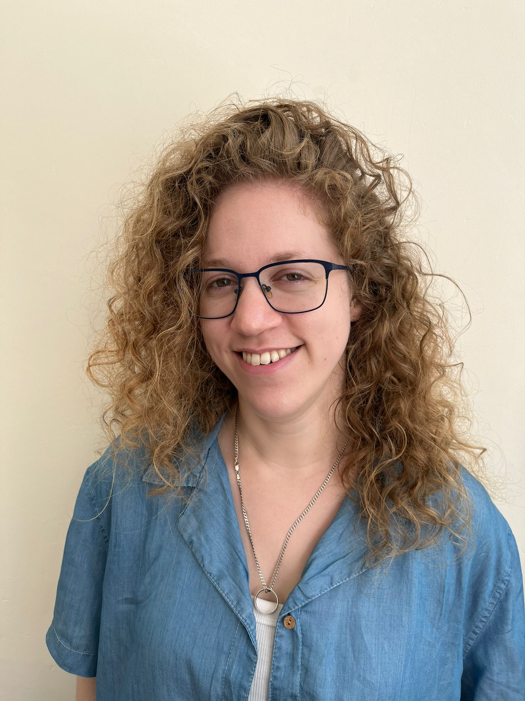

# Welcome!

Hi, I’m **Aileen Cohen**, a Phd student studying systems and molecular biology.  
I’m fascinated by *gene regulation*, *space biology*, and the complexities of *human nature*.

This site is my small corner of the web where you can explore my research, publications, projects, and passions.

I also write on [Medium](https://medium.com/@AileenCo), where I share thoughts that excite me, both scientifically and personally.

Feel free to connect with me via Email:
aileen.cohen@weizmann.ac.il
Or via DMs in X or LinkedIn, which you can find in the navigation tab above.
